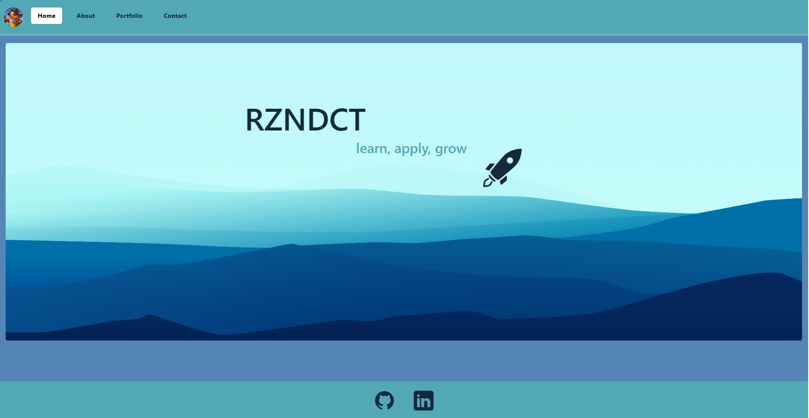
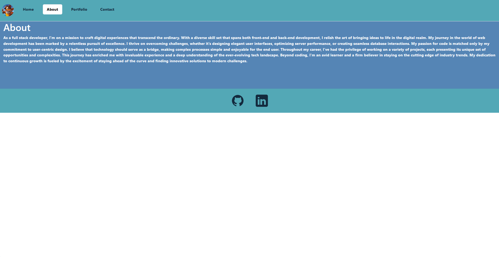
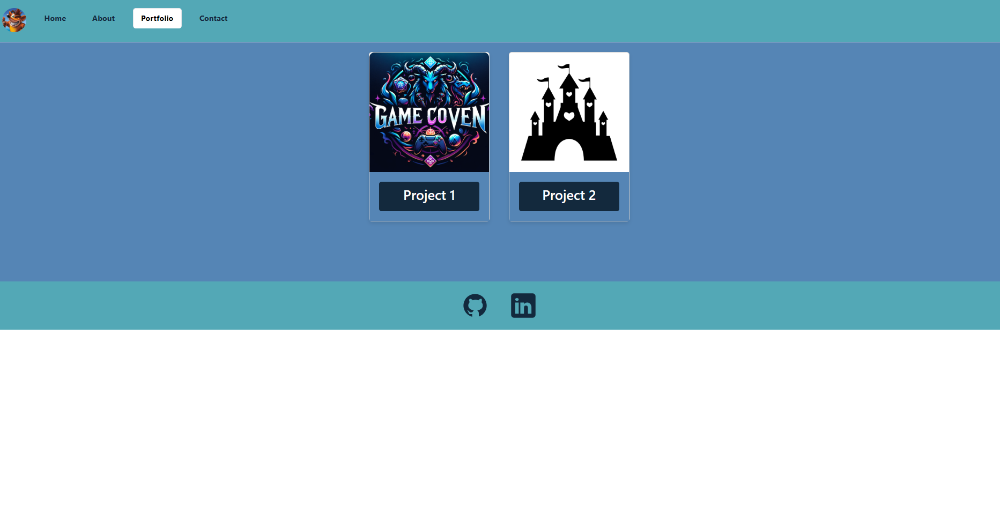
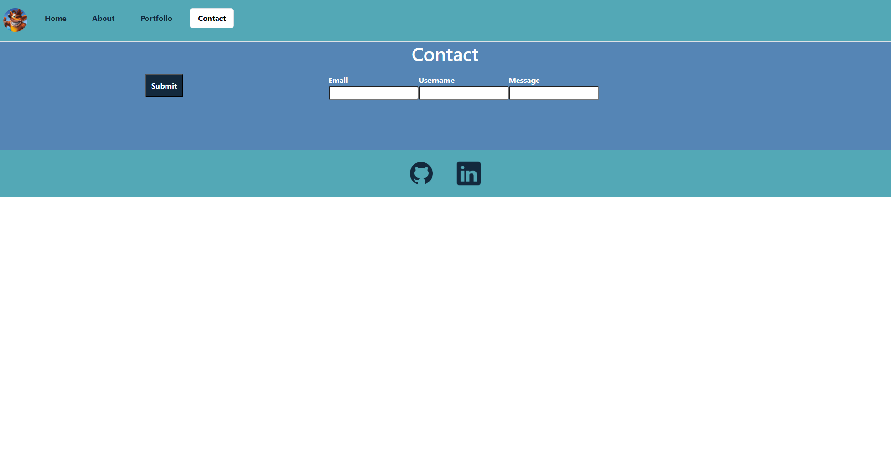

# React Portfolio

A React-based portfolio page showcasing my diverse range of projects and expertise. This platform offers a dynamic and immersive experience for exploring my work.Users can effortlessly delve into my projects, learn about my skills, and gain insights into my journey as a developer. Dive in, explore, and get inspired as you journey through my portfolio, a testament to my dedication, innovation, and passion for technology.







## Table of Contents

- [Installation](#installation)
- [Usage](#usage)
- [Features](#features)
- [Technologies Used](#technologies-used)
- [Demo Video](#demo-video)
- [Contributing](#contributing)

## Installation

To install this application, follow these steps:

1. Clone this repository to your local machine:

```bash
git clone https://github.com/AlirizaBagdat/React-Portfolio
```
2. Navigate to the project directory:

```bash
cd React-Portfolio
```
3. Install the required npm packages:

```bash
npm install
```
4. Start the server using `npm run dev`.

# Usage

Once the server is running, navigate to `http://localhost:3001` in your web browser to view and interact with the website.

## Features

- **User Contact Authentication**: Correct format necessary to Contact.
- **Interface**: User interface style is clean and polished..
- **Experience**: User experience is intuitive and easy to navigate.
- **Responsive Design**: The website is fully responsive, ensuring a seamless experience across various devices.

## Technologies Used

- **Frontend**: HTML, CSS, JavaScript
- **Backend**: [Node.js](https://nodejs.org/)
- **Template Engine**: [React]

## Deployment

This application is deployed on Heroku. Check out the live application [here](https://).

## Contributing

Contributions to improve Game Coven are welcome. Please ensure to update tests as appropriate.